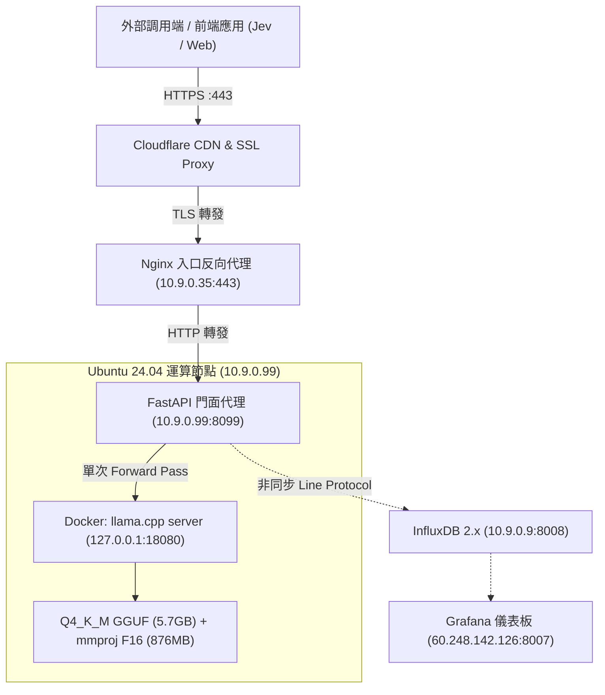

# Cloudflare Clef-Flash Decision Model (GGUF Production Deployment)

[](https://huggingface.co/bartowski/Cloudflare_clef-flash-GGUF)
[](https://github.com/ggml-org/llama.cpp)
[](https://clef.aiurl.tw/docs)
[](https://clef.aiurl.tw/health)

本專案收錄 **Cloudflare Clef-Flash** 決策模型於生產節點（`10.9.0.99`）上的完整部署架構、服務設定檔、FastAPI 門面代理、OpenAPI 3.1 規範、遙測監控推播與維運腳本。

---

## 📌 1. 系統架構拓樸



- **對外主網址**：`https://clef.aiurl.tw`
- **Swagger 互動文件**：[https://clef.aiurl.tw/docs](https://clef.aiurl.tw/docs)
- **ReDoc 規範文檔**：[https://clef.aiurl.tw/redoc](https://clef.aiurl.tw/redoc)
- **健康檢查**：`https://clef.aiurl.tw/health`
- **推論核心端點**：`https://clef.aiurl.tw/v1/systemone`

---

## 🚀 2. 核心特性與規格

1. **決策專用架構 (Non-Autoregressive)**：
   - 透過 Joint Schema Head 在**單次 Forward Pass** 中同時評估所有問題與選項機率。
   - 不生成文字、不產生格式幻覺，極致穩定。
2. **Q4_K_M GGUF 量化加速**：
   - 模型來源：[`bartowski/Cloudflare_clef-flash-GGUF`](https://huggingface.co/bartowski/Cloudflare_clef-flash-GGUF)。
   - 記憶體消耗由原始全精度的 43 GB 驟降至 **3.7 GB**。
   - CPU 推論延遲自 ~60 秒巨幅縮短至 **~3.5 秒**（提速超過 90%）。
3. **高並行與高吞吐配置**：
   - `-c 16384 -np 2`：雙 Slot 並行槽位，各享 8,192 Context 空間。
   - `-b 4096 -ub 4096`：支援高達 4,096 Tokens 的單批次物理推論。
   - `-t 16`：充分調用 16 個 CPU 向量運算核心。
4. **即時遙測 (Telemetry)**：
   - API 背景執行緒直接發送 InfluxDB Line Protocol，零阻塞。
   - 包含多主機 (`host=10.9.0.99`, `host=10.9.0.32`) 切換、延遲 P95、題型分佈、Token 消耗等指標。

---

## ⚠️ 3. 實體 4,096-Token 批次限制與客戶端分塊

### 1. 限制原理
- **物理批次上限**：底層推論引擎參數限制單次推論不得超過 **4,096 Tokens**。
- **Token 放大效應**：
  $$\text{Total Tokens} \approx \text{Tokens}(\text{state}) + \sum_{q \in \text{questions}} (\text{Tokens}(\text{instructions}_q) + \sum_{opt \in criteria_q} \text{Tokens}(opt))$$
- **伺服器「不會自動分塊」(No Server-Side Chunking)**：
  伺服器採用單次前向傳播架構，**不會主動**將超長請求在後端切塊。若總 Prompt 超過 4,096 Tokens，底層引擎將直接回報 HTTP 400/500 錯誤。

### 2. 客戶端自動分塊範例 (TypeScript / JavaScript)
若評估維度龐大或題目眾多，客戶端必須在發送請求前進行自動分塊：

```typescript
export function chunkQuestionsForClef(
  questions: Record<string, any>,
  maxOptionsPerChunk: number = 10
): Array<Record<string, any>> {
  const chunks: Array<Record<string, any>> = [];
  let currentChunk: Record<string, any> = {};
  let currentOptionsCount = 0;

  for (const [key, q] of Object.entries(questions)) {
    const optionCount = q.criteria
      ? (Array.isArray(q.criteria) ? q.criteria.length : Object.keys(q.criteria).length)
      : 2;
    if (currentOptionsCount + optionCount > maxOptionsPerChunk && Object.keys(currentChunk).length > 0) {
      chunks.push(currentChunk);
      currentChunk = {};
      currentOptionsCount = 0;
    }
    currentChunk[key] = q;
    currentOptionsCount += optionCount;
  }

  if (Object.keys(currentChunk).length > 0) {
    chunks.push(currentChunk);
  }
  return chunks;
}
```

---

## 🛠️ 4. 快速部署指南

### 步驟 1：下載模型檔案

執行內建下載腳本（將自動抓取 Q4_K_M 模型與多模態投影矩陣）：

```bash
bash scripts/download_models.sh
```

### 步驟 2：啟動推論引擎與 API 門面

#### 方式 A：使用 Docker Compose（推薦）

```bash
docker compose up -d
```

#### 方式 B：使用原生指令與 Systemd（10.9.0.99 正式環境方式）

1. **啟動 llama-server 容器**：
```bash
docker run -d \
  --name clef-flash-gguf-server \
  --restart unless-stopped \
  -v $(pwd)/models:/models:ro \
  -p 127.0.0.1:18080:8080 \
  ghcr.io/ggml-org/llama.cpp:server \
  -m /models/Cloudflare_clef-flash-Q4_K_M.gguf \
  --mmproj /models/mmproj-Cloudflare_clef-flash-f16.gguf \
  --host 0.0.0.0 \
  --port 8080 \
  -c 16384 \
  -b 4096 \
  -ub 4096 \
  -t 16 \
  -np 2
```

2. **設置 Python 虛擬環境與 API 門面**：
```bash
python3 -m venv .venv
source .venv/bin/activate
pip install -r requirements.txt
```

3. **註冊為 Systemd 系統服務**：
```bash
sudo cp systemd/clef-flash.service /etc/systemd/system/
sudo systemctl daemon-reload
sudo systemctl enable --now clef-flash.service
```

---

## 📡 5. API 呼叫範例

### cURL 推論請求

```bash
curl -X POST https://clef.aiurl.tw/v1/systemone \
  -H "Content-Type: application/json" \
  -d '{
    "model": "clef-flash",
    "state": "使用者反映於結帳步驟出現 HTTP 504 Gateway Timeout，信用卡款項已扣款但系統未產生訂單。",
    "questions": {
      "department": {
        "type": "choice",
        "instructions": "判斷此工單應指派給哪個部門處理？",
        "criteria": {
          "billing": "款項扣除、退款、對帳相關問題",
          "tech": "伺服器超時、API 錯誤、系統故障",
          "customer_support": "一般諮詢或常見問題"
        }
      },
      "urgency": {
        "type": "score",
        "instructions": "判斷此事件處理緊急程度",
        "criteria": ["可稍後處理", "今日處理", "即刻緊急處理 (P0)"]
      },
      "is_system_down": {
        "type": "noul",
        "instructions": "是否屬於核心服務中斷或重大故障？"
      }
    }
  }'
```

### 回應格式

```json
{
  "model": "clef-flash-q4_k_m",
  "answers": {
    "department": {
      "type": "choice",
      "choice": "tech",
      "confidence": 0.637,
      "probabilities": {
        "billing": 0.228,
        "customer_support": 0.014,
        "tech": 0.758
      }
    },
    "urgency": {
      "type": "score",
      "score": 1.905,
      "confidence": 0.857,
      "legend": {
        "0": "可稍後處理",
        "1": "今日處理",
        "2": "即刻緊急處理 (P0)"
      },
      "probabilities": {
        "0": 0.010,
        "1": 0.076,
        "2": 0.914
      }
    },
    "is_system_down": {
      "type": "noul",
      "noul": 0.481
    }
  },
  "usage": {
    "input_tokens": 372,
    "output_tokens": 0
  },
  "latency_seconds": 4.890
}
```

---

## 📂 6. 專案目錄結構

```text
clef-flash-gguf/
├── .gitignore                    # Git 忽略清單 (排他性過濾 GGUF 模型檔與 venv)
├── README.md                     # 專案總覽與使用說明
├── DEPLOYMENT_10.9.0.99.md       # 10.9.0.99 生產環境完整建置技術文件
├── GRAFANA_KNOWHOW.md            # Grafana 監控指標、Flux 語法與踩坑筆記
├── openapi.json                  # OpenAPI 3.1 規範綱要 (含 4096-token 限制說明)
├── api_server.py                 # FastAPI 核心服務程式碼 (支援 InfluxDB 遙測)
├── requirements.txt              # Python 相依套件
├── docker-compose.yml            # Docker Compose 完整編排檔
├── Dockerfile                    # API 門面容器建置檔
├── systemd/
│   └── clef-flash.service        # Ubuntu 24.04 Systemd 服務單元檔
├── nginx/
│   └── clef.aiurl.tw.conf        # Nginx 反向代理與 SSL 配置
├── models/
│   └── README.md                 # 模型存放目錄說明
└── scripts/
    ├── download_models.sh        # 自動下載 Q4_K_M 與 mmproj 權重
    ├── run_server.sh             # 虛擬環境啟動腳本
    ├── test_inference.py         # API 推論驗證腳本
    └── test_clef_cpu.py          # 底層 CPU 原生推論測試腳本
```

---

## 📖 7. 深入參考文件

- 🚀 [DEPLOYMENT_10.9.0.99.md](DEPLOYMENT_10.9.0.99.md)：涵蓋主機硬體設定、雙 Slot 並行配置、Nginx SSL 設定、維運指令與實體限制防禦。
- 📊 [GRAFANA_KNOWHOW.md](GRAFANA_KNOWHOW.md)：涵蓋 InfluxDB Line Protocol 協議規格、Grafana 儀表板 Flux 查詢、多主機動態切換設定與常見錯誤排除。
